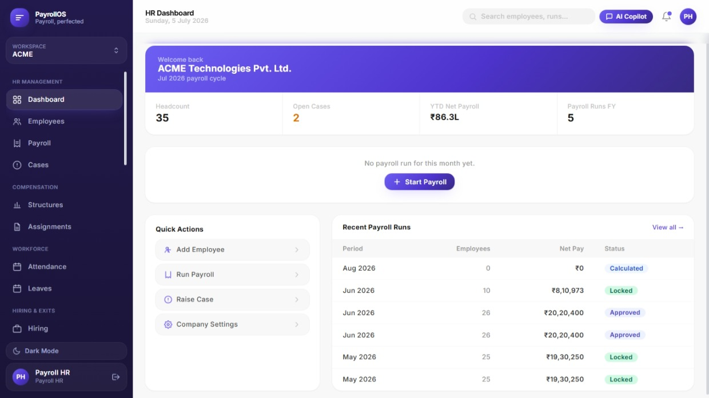
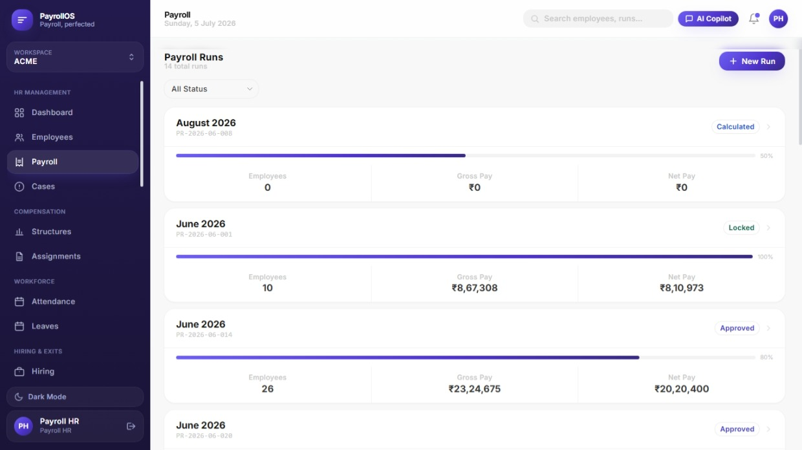
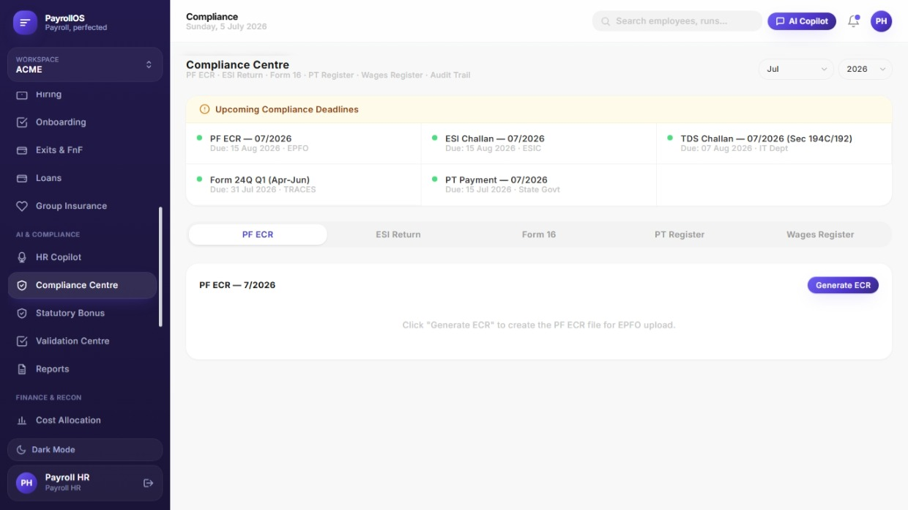
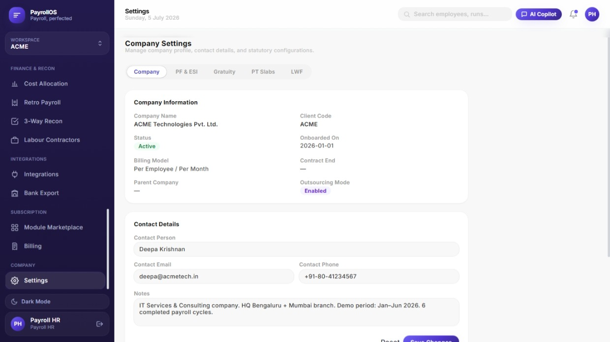

# PayrollOS Community

**PayrollOS — The AI Payroll Operating System for Frappe & ERPNext.**

An open-source, self-hostable payroll console built on top of [Frappe HR](https://github.com/frappe/hrms) — run payroll, manage salary structures, and issue payslips from one clean admin console.

PayrollOS Community does not define its own payroll engine or its own Employee/Salary Slip records. ##It's a Modern Payroll Operating System built on top of the battle-tested Frappe HR payroll engine., battle-tested `hrms` Payroll module (Salary Structure, Salary Structure Assignment, Salary Component, Salary Slip, Payroll Entry). Your data lives in standard Frappe HR doctypes — no lock-in.

## Screenshots

<sub>From the PayrollOS Pro workspace — a preview of the premium UI this project is built on. Compliance Centre and Settings shown below are Pro-only; Community covers the Dashboard and Payroll Runs experience.</sub>

| | |
|---|---|
|  |  |
|  |  |

## What's in Community vs Pro

**Community** covers the payroll core for free, forever, self-hosted: run payroll end to end
on top of standard Frappe HR, no lock-in, no per-employee fee.

**Pro** is a paid add-on for teams that need statutory compliance, the full HR lifecycle,
and automation on top of that core.

| Module | Community | Pro |
|---|:---:|:---:|
| Employees, Salary Structures, Payroll Runs, Payslips | ✅ | ✅ |
| Attendance, Leave, Employee Loans, Holiday Calendar | — | ✅ |
| Hiring & Onboarding — requisitions, pipeline, interviews, offer letters, exits, F&F | — | ✅ |
| Statutory Compliance — PF ECR, ESI challan, PT, Form 16 / 24Q, TDS reconciliation, YTD import | — | ✅ |
| Gratuity, Statutory Bonus, Group Insurance (GMC/GPA/GTL/GHI) | — | ✅ |
| Expense Reimbursements — claims, approvals, payroll payout | — | ✅ |
| Payroll Ops — parallel-run validation, bank reconciliation, arrears, payroll calendar | — | ✅ |
| Bank Export — NEFT/RTGS/IMPS payment files (ICICI/Axis/HDFC and more) | — | ✅ |
| Analytics & Dashboards — cost analysis, headcount/attrition trends, SLA & audit reports | — | ✅ |
| AI HR Copilot, JD Generator, Resume Parser, AI Screening, Anomaly Detection | — | ✅ |
| Integrations — WhatsApp/Slack/Teams notifications, biometric devices, job boards | — | ✅ |

Locked nav items in the app show exactly this — click one to see what it unlocks.

### Pricing tiers

| Tier | Includes | Price |
|---|---|---|
| **Community** | Payroll, Salary Structure, Payslip, Payroll Runs | Free |
| **Growth** | + Attendance, Leave, Employee Loans | ₹49/employee/month |
| **Business** | Growth + Compliance — PF, ESI, PT, TDS, Form 16 / 24Q, Bank Export | ₹69/employee/month |
| **Enterprise** | Everything + AI — AI Copilot, Resume Parser, JD Generator, Anomaly Detection, Analytics & Dashboards, Integrations, SLA, Priority Support, Custom Branding, SSO | ₹89–99/employee/month |

Each tier includes everything in the tier below it. Reach out for a quote for your headcount.

## Requirements

Because this app depends on `hrms`, and `hrms` itself depends on `erpnext`, a full install is:

- Frappe v15
- ERPNext v15
- Frappe HR (`hrms`) v15.60+
- This app (`payroll_os_community`)

This is **not** a lightweight frappe-only install — it brings in the full ERPNext stack as a dependency. If you already run ERPNext + HR, this is just one more app on top.

## Installation

```bash
bench get-app hrms
bench get-app payroll_os_community https://github.com/amet123/payrollos-community

bench new-site yoursite.local
bench --site yoursite.local install-app hrms
bench --site yoursite.local install-app payroll_os_community
```

## First login

```
http://yoursite.local/payrollos
```

Log in with the Administrator account and password you set during `bench new-site`.

## Upgrading to Pro

PayrollOS Pro is a separate, privately-licensed add-on app that installs alongside Community (`bench get-app` + `bench install-app` for the Pro app, in addition to Community — not a config flag). It unlocks statutory compliance, hiring, loans, reimbursements, gratuity/bonus/insurance, an AI copilot, and more.

**Note:** Pro runs its own independent data model — installing it does not merge with the Employees/Payroll Runs you've already created in Community. This is a known v1 limitation.

Contact your PayrollOS administrator, or reach out at hello@payrollos.app, to get access.

## License

MIT — see [LICENSE](LICENSE).

## Contributing

Issues and PRs welcome.
